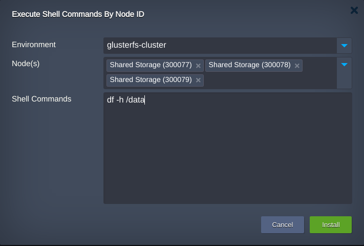
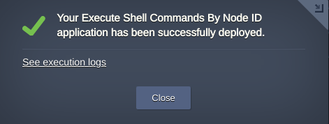
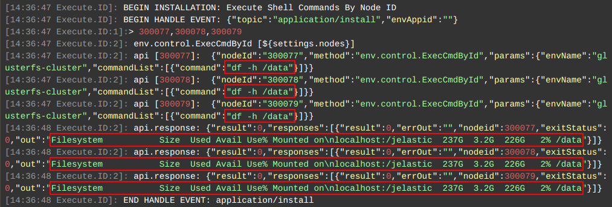

# Execute CLI Commands by NodeID Add-On

This Add-On allows to execute set of shell commands on any node in an environment. In case  the environment has multiple nodes user may select any required or even all of them to execute commands at once.

The Add-On can be applied to any environment within your [Jelastic Cloud](https://jelastic.cloud) account.

## How to Apply Commands Execution

Copy link to the **_manifest.yaml_** file above and [import](https://docs.jelastic.com/environment-import) it to your Jelastic dashboard.

 

Within the installation frame:   

- choose the target **Environment** that should be managed by add-on  
- pick the **Node(s)** in which the actions must be performed  
- specify CLI command(s) to be executed in the **Shell Commands** field   

> **Note:**  

>   * *Shell Commands* field should contain no empty lines   
>   * all the commands are executed as certified template default user

Click **Install** to initiate command execution.

The command execution results can be accessed by the link **See execution logs** in the confirmation window:

 

### Check the Results

Open the [Cloud Scripting  execution logs](https://docs.cloudscripting.com/troubleshooting/#troubleshooting) to see the results of command(s) execution on all selected nodes:
 

 

